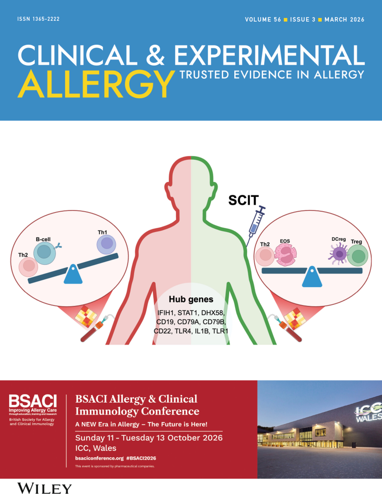
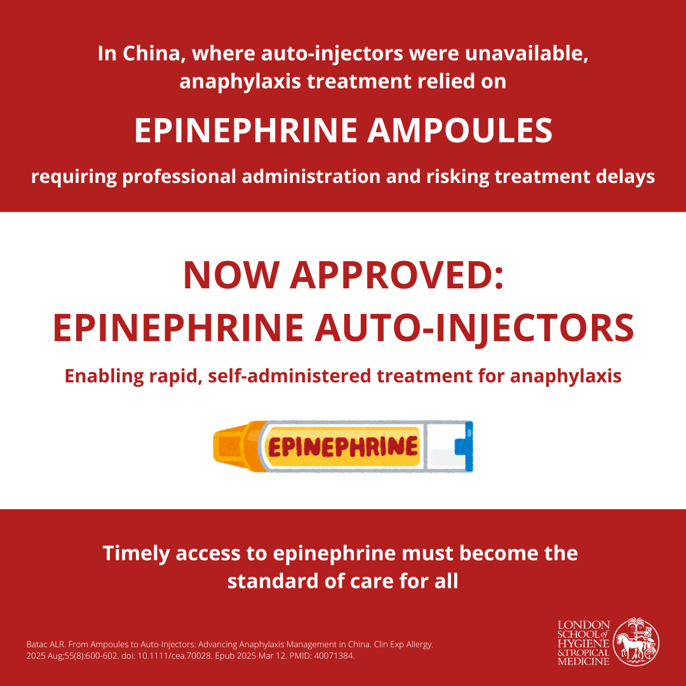

# ANAPHYLAXIS

$~$

**Anaphylaxis** is an acute and potentially **life-threatening** systemic allergic reaction that requires rapid recognition and immediate treatment with **intramuscular adrenaline (epinephrine)**. Despite the availability of clinical guidelines and increasing global awareness, the management of anaphylaxis remains **inconsistent**, particularly in low-resource settings. Several barriers contribute to this gap, including limited access to adrenaline, delays in diagnosis, and inadequate emergency response systems. These challenges continue to drive preventable morbidity and mortality worldwide.

## Understanding Global Variation in Anaphylaxis Treatment

There is growing recognition of **global variation** in how anaphylaxis is treated across different healthcare systems. While adrenaline is the recommended first-line treatment, evidence shows it remains under-utilized worldwide, with antihistamines and glucocorticoids often used instead in emergency and acute care settings. This variation may be influenced by differences in clinical training, national guidelines, healthcare infrastructure, or cultural practices.

Our current research is synthesizing global evidence on:

- **International differences** in anaphylaxis treatment and outcomes  
- **Access to adrenaline**, including adrenaline auto-injectors (AAIs) and ampoules  
- **Alignment with clinical guidelines** across healthcare systems  
- **Barriers to timely care**, including regulatory, cost, and training constraints  

This research aims to characterize diverse treatment practices across global contexts. The findings are intended to inform policy recommendations that support more consistent, evidence-based emergency care for anaphylaxis worldwide.

```{=html}
<p style="font-size: 1.5rem; font-weight: 600; color: #1B153E; margin-bottom: 1rem;">
  Featured Publication
</p>

<div style="display: flex; flex-wrap: wrap; gap: 2rem; align-items: flex-start; margin-top: 1.5rem;">

  <!-- Infographic Image -->
  <div style="flex: 0 0 400px;">
    <a href="https://doi.org/10.1111/cea.70273" target="_blank" rel="noopener noreferrer">
      
    </a>
  </div>

  <!-- Publication Description -->
  <div style="flex: 1; min-width: 250px;">

    <!-- Title -->
    <h3 style="font-weight: 600; color: #1B153E; margin: 0 0 1rem 0; font-size: 1.05rem;">
      <a href="https://doi.org/10.1111/cea.70273"
        target="_blank"
        rel="noopener noreferrer"
        style="color: inherit; text-decoration: none; font-weight: inherit;"
        onmouseover="this.style.color='#DE2221'"
        onmouseout="this.style.color='#1B153E'">
        Global Variation in Anaphylaxis Treatment: A Scoping Review Protocol
      </a>
    </h3>

    <!-- Description -->
    <p>
      This protocol presents a scoping review investigating global variation in the emergency management of anaphylaxis. The forthcoming review will map differences in treatment practices and evaluate alignment with international guidelines, particularly regarding adrenaline use. The review will also examine contextual factors driving variation and identify evidence gaps to inform future research and health system improvements. The findings will provide a structured overview of current practice and areas requiring further investigation.
    </p>
    
<div style="margin-top: 1rem; margin-bottom: 1rem;">
  <a href="https://doi.org/10.1111/cea.70273"
     target="_blank"
     rel="noopener noreferrer"
     class="explore-button"
     style="
       flex: 0 0 auto;
       padding: 0.4rem 1rem !important;
       font-size: 0.9rem !important;
       width: auto !important;
       min-width: unset !important;
       white-space: nowrap !important;
       text-align: center;
       display: inline-block !important;
     ">
    Read article
  </a>
</div>

    <!-- Citation -->
    <p style="font-size: 0.70rem;">
      <a href="https://doi.org/10.1111/cea.70273" target="_blank" rel="noopener noreferrer" style="text-decoration: none; color: #1B153E;" onmouseover="this.style.color='#DE2221'" onmouseout="this.style.color='#1B153E'">
        <strong>Batac ALR</strong>, Wong-Pack A, Lê ML, Reyes JCR, Bhamra MK, Hong B, Feldman LY, Fong AT, Bégin P. Global Variation in Anaphylaxis Treatment: A Scoping Review Protocol. Clin Exp Allergy. 2026 Mar 6. doi: 10.1111/cea.70273. Epub ahead of print. PMID: 41792974.
      </a>
    </p>

  </div>
</div>
```

$~$

## Anaphylaxis Treatment in China

In this work, I examined the introduction and integration of AAIs in mainland China, highlighting several persistent challenges in a context where access had historically been limited:

- Outlined the evolving landscape of anaphylaxis management in China    
- Highlighted systemic barriers to AAI access and implementation  
- Identified gaps in clinical training and public awareness  
- Explored how global best practices may inform national protocols  
- Contributed to broader discussions on health equity and emergency preparedness  

This work underscores the need for sustained policy attention, enhanced clinical training, and system-level adaptation to expand access to life-saving anaphylaxis treatment and strengthen emergency preparedness.

```{=html}
<p style="font-size: 1.5rem; font-weight: 600; color: #1B153E; margin-bottom: 1rem;">
  Featured Publication
</p>

<div style="display: flex; flex-wrap: wrap; gap: 2rem; align-items: flex-start; margin-top: 1.5rem;">

  <!-- Infographic Image -->
  <div style="flex: 0 0 400px;">
    <a href="https://doi.org/10.1111/cea.70028" target="_blank" rel="noopener noreferrer">
      
    </a>
  </div>

  <!-- Publication Description -->
  <div style="flex: 1; min-width: 250px;">

    <!-- Title -->
    <h3 style="font-weight: 600; color: #1B153E; margin: 0 0 1rem 0; font-size: 1.05rem;">
      <a href="https://doi.org/10.1111/cea.70028"
        target="_blank"
        rel="noopener noreferrer"
        style="color: inherit; text-decoration: none; font-weight: inherit;"
        onmouseover="this.style.color='#DE2221'"
        onmouseout="this.style.color='#1B153E'">
        From Ampoules to Auto-Injectors: Advancing Anaphylaxis Management in China
      </a>
    </h3>

    <!-- Description -->
    <p>
      This publication explores anaphylaxis treatment in mainland China, focusing on the introduction of adrenaline auto-injectors. It highlights key challenges such as regulatory barriers, cost, and limited awareness, and proposes policy solutions to improve access to life-saving care within national emergency response systems.
    </p>
    
<div style="margin-top: 1rem; margin-bottom: 1rem;">
  <a href="https://doi.org/10.1111/cea.70028"
     target="_blank"
     rel="noopener noreferrer"
     class="explore-button"
     style="
       flex: 0 0 auto;
       padding: 0.4rem 1rem !important;
       font-size: 0.9rem !important;
       width: auto !important;
       min-width: unset !important;
       white-space: nowrap !important;
       text-align: center;
       display: inline-block !important;
     ">
    Read article
  </a>
</div>

    <!-- Citation -->
    <p style="font-size: 0.70rem;">
      <a href="https://doi.org/10.1111/cea.70028" target="_blank" rel="noopener noreferrer" style="text-decoration: none; color: #1B153E;" onmouseover="this.style.color='#DE2221'" onmouseout="this.style.color='#1B153E'">
        <strong>Batac ALR.</strong> From Ampoules to Auto-Injectors: Advancing Anaphylaxis Management in China. Clin Exp Allergy. 2025 Aug;55(8):600-602. doi: 10.1111/cea.70028. Epub 2025 Mar 12. PMID: 40071384.
      </a>
    </p>

  </div>
</div>
```

$~$

## Contribution to Public Health

Anaphylaxis is both a clinical emergency and a public health concern. Our research addresses critical gaps in how anaphylaxis is recognized, treated, and prevented across diverse health systems. By examining variations in treatment practices and barriers to adrenaline access, this work informs strategies to reduce preventable morbidity and mortality on a population level.

Key public health contributions include:

- Generating evidence to support **policy and regulatory reform** on adrenaline access  
- Informing **training and education strategies** for clinicians, emergency responders, and the public  
- Identifying opportunities to **standardize emergency care protocols** in alignment with global best practices  
- Contributing to **health equity initiatives** by addressing disparities in access to life-saving treatment  
- Supporting **international collaboration** on anaphylaxis research and response planning  

This work aims to bridge clinical insight with system-level action, reinforcing the importance of coordinated, evidence-based approaches to allergy emergencies in public health planning and preparedness.

$~$

*Stay tuned – publications and data visualizations related to this work will be made available here soon.*

$~$

<small>
This research is conducted under my leadership in collaboration with physician and allied health partners in Canada, the United Kingdom, and Australia. It reflects a shared commitment to advancing evidence-based and patient-centred approaches to the prevention, recognition, and management of anaphylaxis.
</small>

<style>
  h1, h2, h3, p {
    color: #1B153E;
  }
</style>
