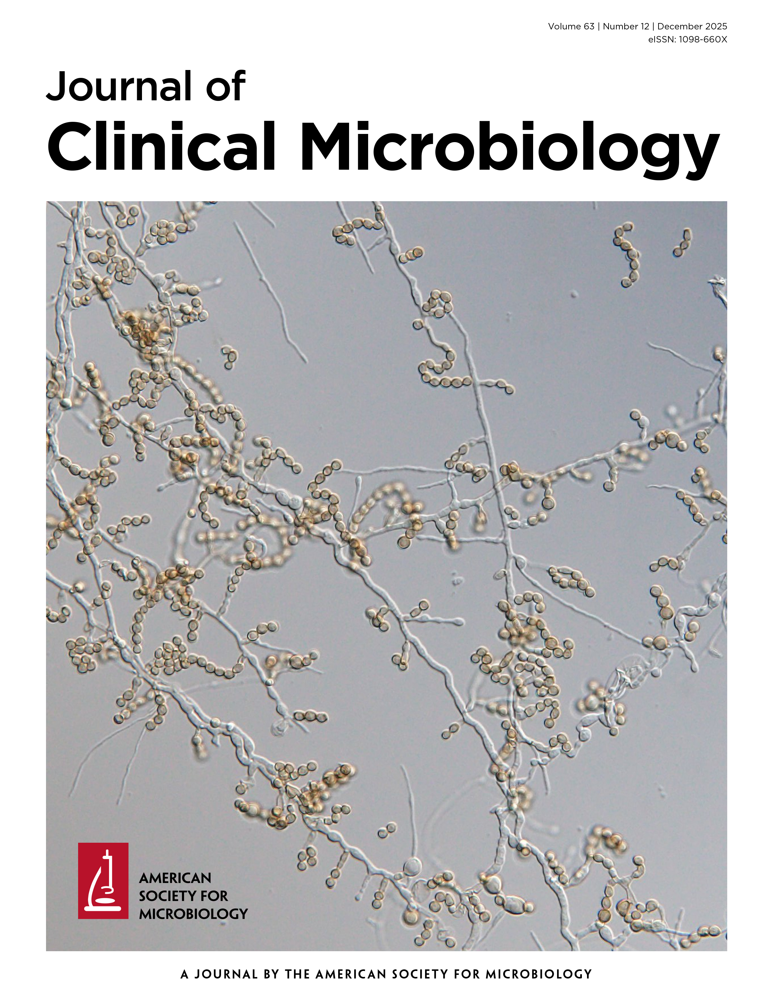

# DIAGNOSTICS

$~$

**Diagnostics** are fundamental to effective public health systems. Accurate and timely testing enables early detection of disease, guides treatment decisions, and supports surveillance efforts that inform prevention strategies. However, many health systems continue to rely heavily on facility-based diagnostic models that can limit access for populations facing structural, social, or geographic barriers to care.

In sexually transmitted infections (STIs), delayed or missed diagnoses remain a major driver of ongoing transmission and adverse health outcomes. Syphilis, for example, has resurged globally despite the availability of effective testing and curative treatment. Early symptoms are often mild or absent, and barriers such as stigma, inconvenient clinic hours, travel distance, and financial costs can discourage individuals from accessing facility-based testing services.

These challenges highlight the need for innovative diagnostic approaches that expand access to testing while maintaining quality and integration with health systems.

## Decentralizing Diagnostics Through Self-Testing

My research focuses on diagnostic innovations that enable more accessible and user-centered approaches to disease detection. One emerging strategy is **self-testing**, which allows individuals to collect their own samples, perform diagnostic tests, and interpret results outside of traditional clinical settings.

Recent regulatory approvals of over-the-counter syphilis self-tests represent a major development in STI diagnostics. These tests typically use finger-prick blood samples to detect treponemal antibodies to *Treponema pallidum* and provide results within minutes. Evidence suggests that syphilis self-testing is accurate, usable, and acceptable across diverse populations.

By enabling private and rapid testing, self-testing approaches have the potential to overcome many barriers associated with clinic-based diagnostics, including stigma, long waiting times, and limited access to specialized laboratory services.

## Expanding Access to Testing

Evidence from multiple studies shows that self-testing can significantly increase diagnostic uptake, particularly among populations underserved by traditional health systems. Randomized trials and observational studies have demonstrated that self-testing strategies increase testing rates and reach individuals who have never previously been tested.

Self-testing also offers opportunities for integration with digital health tools, community-based distribution models, and existing HIV self-testing programs. These approaches can expand testing coverage while supporting individuals in interpreting results and linking to confirmatory care.

However, effective implementation requires careful attention to health system integration. Self-tests should be positioned as entry points within diagnostic pathways, ensuring that individuals with reactive results receive confirmatory testing, treatment, and follow-up care.

## Implementation and Health System Integration

While diagnostic self-testing presents important opportunities, several implementation challenges remain. Current syphilis self-tests detect treponemal antibodies that indicate past or present infection but cannot distinguish between active infection and previously treated disease. As a result, confirmatory testing within clinical settings remains essential for appropriate diagnosis and treatment.

Additional considerations include ensuring equitable access to diagnostic technologies, maintaining quality assurance, and supporting linkage to care. Lessons from the global expansion of HIV self-testing highlight the importance of integrating digital support systems, community engagement, and clear referral pathways to ensure that self-testing contributes effectively to public health outcomes.

## Contribution to Public Health

Research on diagnostic innovation contributes to strengthening health systems by improving access to testing and enabling earlier detection of disease. Self-testing strategies, when integrated with clinical services and public health programs, have the potential to:

- Expand diagnostic coverage among underserved and high-risk populations    
- Reduce delays between infection, diagnosis, and treatment   
- Support more responsive surveillance and disease control strategies   
- Promote more accessible and user-centered approaches to healthcare    

By examining how new diagnostic technologies can be effectively implemented within health systems, this research aims to advance more equitable, scalable, and responsive models of disease detection and prevention.

$~$

```{=html}
<p style="font-size: 1.5rem; font-weight: 600; color: #1B153E; margin-bottom: 1rem;">
  Featured Publication
</p>

<div style="display: flex; flex-wrap: wrap; gap: 2rem; align-items: flex-start; margin-top: 1.5rem;">

  <!-- Infographic Image -->
  <div style="flex: 0 0 400px;">
    <a href="https://doi.org/10.1128/jcm.00982-25" target="_blank" rel="noopener noreferrer">
      
    </a>
  </div>

  <!-- Publication Description -->
  <div style="flex: 1; min-width: 250px;">

    <!-- Title -->
    <h3 style="font-weight: 600; color: #1B153E; margin: 0 0 1rem 0; font-size: 1.05rem;">
      Syphilis self-testing and implications for syphilis control and prevention
    </h3>

    <!-- Description -->
    <p>
      This Editor’s Pick article in the <i>Journal of Clinical Microbiology</i> examines the emerging role of syphilis self-testing in expanding access to diagnostic services and strengthening global syphilis control efforts. It highlights persistent barriers to facility-based testing, including stigma, limited access to clinics, and health system constraints, and explores how over-the-counter self-testing technologies can improve testing uptake among underserved populations. The article also discusses key implementation challenges, including linkage to confirmatory care, equitable access to diagnostics, and integration of self-testing within existing public health and surveillance systems.
    </p>

    <!-- Citation -->
    <p style="font-size: 0.70rem;">
      <a href="https://doi.org/10.1128/jcm.00982-25" target="_blank" rel="noopener noreferrer" style="text-decoration: none; color: #1B153E;" onmouseover="this.style.color='#DE2221'" onmouseout="this.style.color='#1B153E'">
        <strong>Batac ALR</strong>, Marks M, Tucker JD, Peeling RW. Syphilis self-testing and implications for syphilis control and prevention. J Clin Microbiol. 2025 Dec 17;63(12):e0098225. doi: 10.1128/jcm.00982-25. Epub 2025 Oct 21. PMID: 41117600; PMCID: PMC12710337.
      </a>
    </p>

  </div>
</div>
```

$~$

*Stay tuned — publications and data visualizations related to this work will be made available here soon.*

<style>
  h1, h2, h3, p {
    color: #1B153E;
  }
</style>
