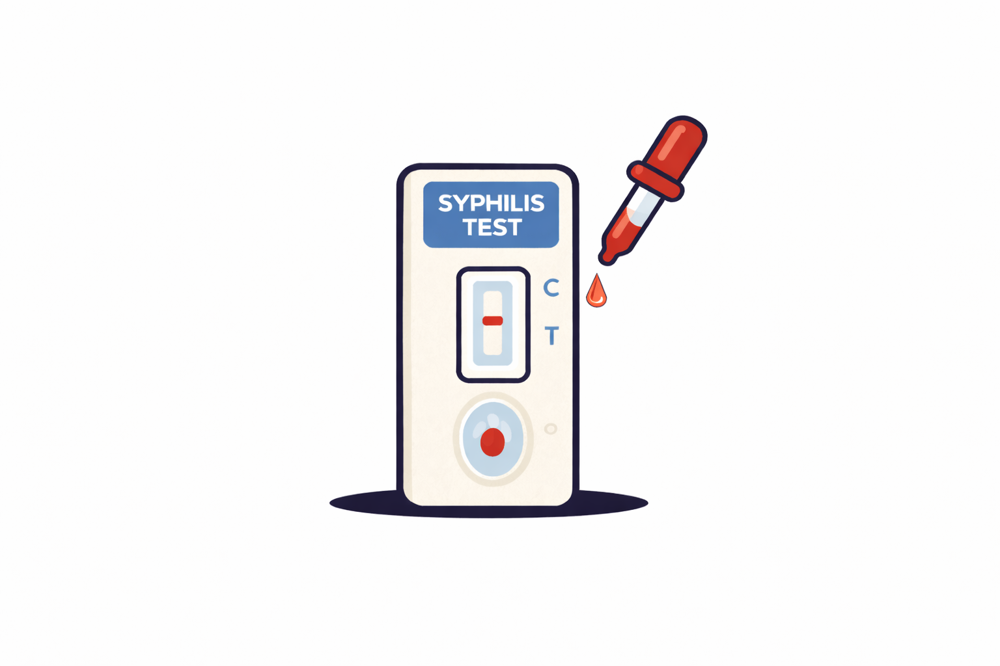
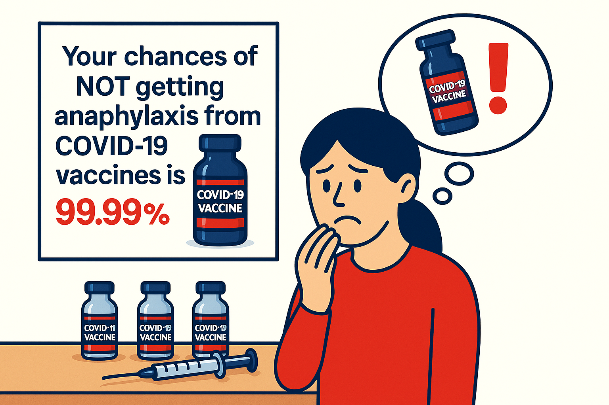
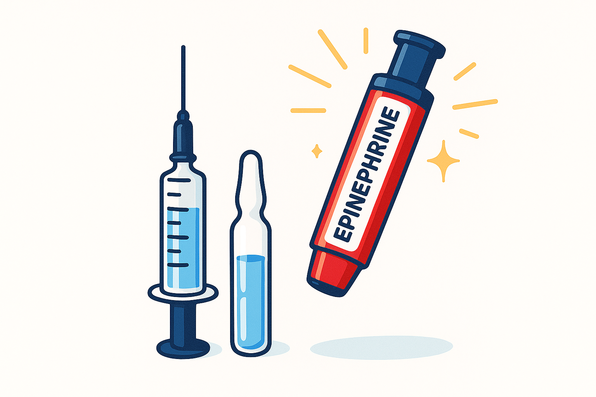
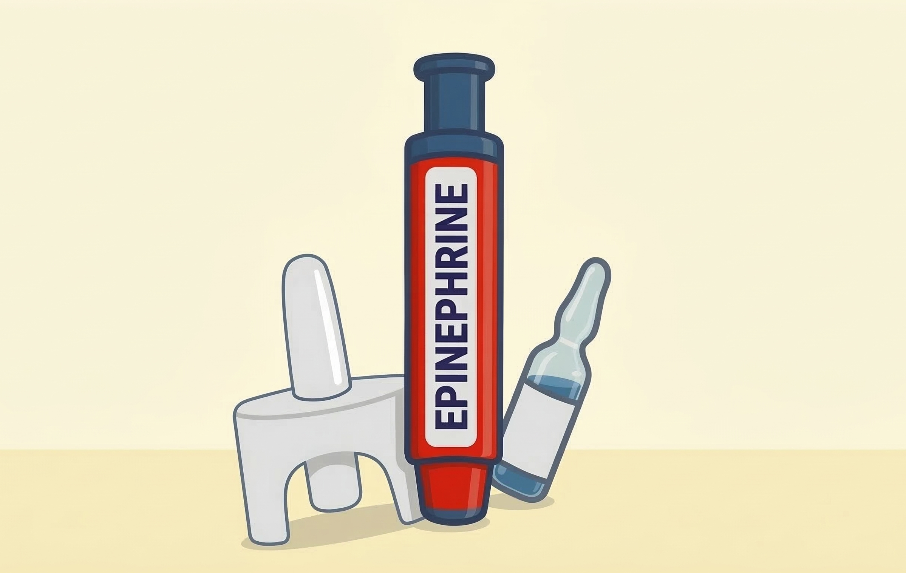
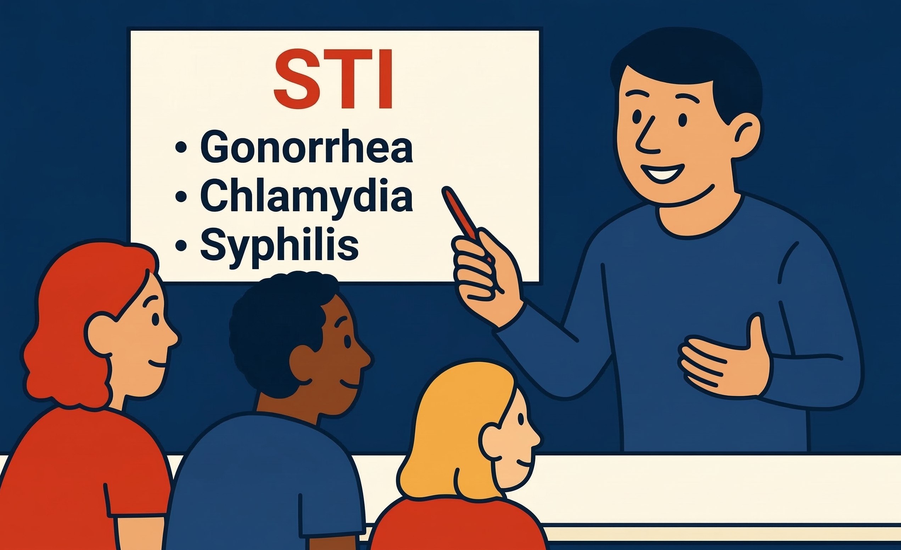
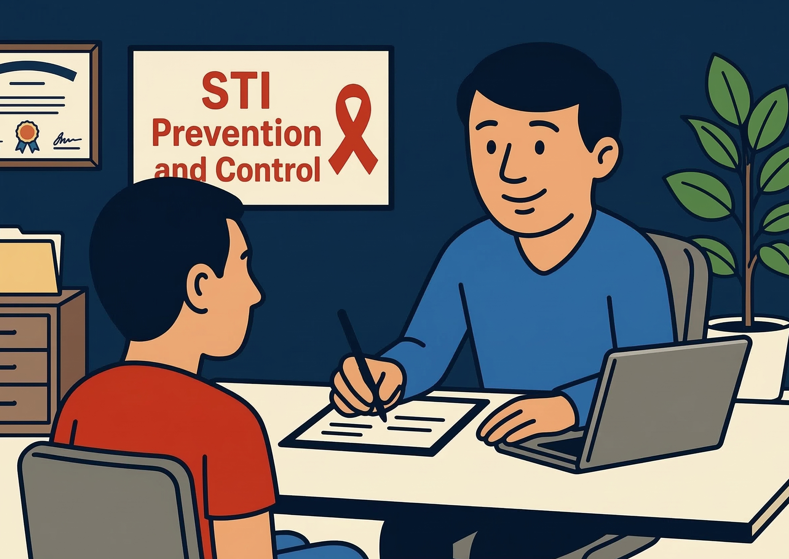
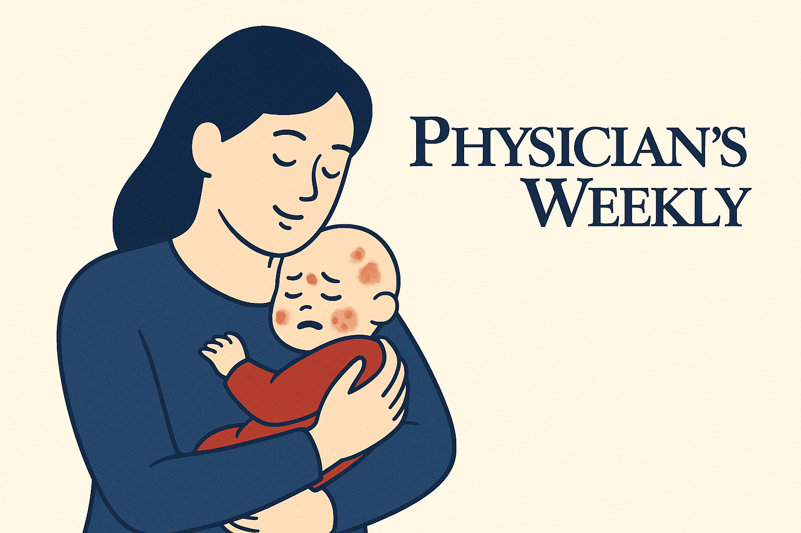

```{=html}

<!-- Full-width Banner Section -->
<div style="
  position: relative;
  width: 100vw;
  height: 500px;
  margin-left: calc(-50vw + 50%);
  margin-top: -4rem;
  margin-bottom: 1.5rem;
  overflow: hidden;
  background-color: #ffffff;
">

  

  <!-- Indigo gradient extending upward -->
  <div style="
    position: absolute;
    inset: 0;
    background: linear-gradient(
      to top,
      rgba(27, 21, 62, 0.96) 0%,
      rgba(27, 21, 62, 0.82) 25%,
      rgba(27, 21, 62, 0.48) 48%,
      rgba(27, 21, 62, 0) 68%
    );
  "></div>

  <!-- Text content at the bottom -->
  <div style="
    position: absolute;
    top: 0;
    left: 0;
    right: 0;
    height: 100%;
    box-sizing: border-box;
    padding: 0 2rem 1.5rem 2rem;
    display: flex;
    flex-direction: column;
    justify-content: flex-end;
    color: #ffffff;
  ">

    <div style="
      margin-bottom: 0.5rem;
      font-size: 1.8rem;
      line-height: 1.2;
      font-weight: bold;
    ">
      Bringing tuberculosis screening to the community
    </div>

    <div style="
      margin-bottom: 0.5rem;
      line-height: 1.4;
    ">
      Lessons from implementing community-wide tuberculosis screening in a remote Arctic community.
    </div>

    <a
      href="https://doi.org/10.1080/22423982.2026.2700154"
      target="_blank"
      rel="noopener noreferrer"
      style="
        width: fit-content;
        color: #ffffff;
        text-decoration: underline;
        text-underline-offset: 3px;
      "
    >
      Read More
    </a>

  </div>
</div>

```

```{=html}

<!-- Full-width Spotlight Section -->
<div style="width: 100vw; margin-left: calc(-50vw + 50%); padding: 3rem 2rem; background-color: #ffffff;">

  <!-- Title (HTML, not markdown) to avoid anchor icon -->
  <div style="color: #1B153E; text-transform: uppercase; font-weight: bold; font-size: 1.75rem; margin-bottom: 2rem;">SPOTLIGHT</div>

  <div style="display: flex; flex-wrap: wrap; gap: 2rem;">

        <!-- Tile 1: Syphilis -->
    <a href="https://doi.org/10.1128/jcm.00982-25" target="_blank" style="flex: 1; min-width: 300px; text-decoration: none; color: inherit; display: flex; flex-direction: column;">
      <div style="display: flex; flex-direction: column; height: 100%; border-radius: 10px; overflow: hidden; box-shadow: 0 6px 16px rgba(0,0,0,0.08); transition: transform 0.3s, box-shadow 0.3s;" 
        onmouseover="this.style.transform='scale(1.02)'; this.style.boxShadow='0 8px 20px rgba(0,0,0,0.12)'" 
        onmouseout="this.style.transform='scale(1)'; this.style.boxShadow='0 6px 16px rgba(0,0,0,0.08)'">
        
        <div style="padding: 1rem; display: flex; flex-direction: column; flex-grow: 1;">
          <div style="font-weight: bold; color: #1B153E; font-size: 1.1rem;">Syphilis Self-Testing Is Here</div>
          <p style="margin-top: 0.5rem; color: #444;">What does over-the-counter syphilis testing mean for syphilis prevention and control?</p>
        </div>
      </div>
    </a>
    
    <!-- Tile 2: ACCORD Review -->
    <a href="https://doi.org/10.1016/j.jacig.2025.100522" target="_blank" style="flex: 1; min-width: 300px; text-decoration: none; color: inherit; display: flex; flex-direction: column;">
      <div style="display: flex; flex-direction: column; height: 100%; border-radius: 10px; overflow: hidden; box-shadow: 0 6px 16px rgba(0,0,0,0.08); transition: transform 0.3s, box-shadow 0.3s;" 
        onmouseover="this.style.transform='scale(1.02)'; this.style.boxShadow='0 8px 20px rgba(0,0,0,0.12)'" 
        onmouseout="this.style.transform='scale(1)'; this.style.boxShadow='0 6px 16px rgba(0,0,0,0.08)'">
        
        <div style="padding: 1rem; display: flex; flex-direction: column; flex-grow: 1;">
          <div style="font-weight: bold; color: #1B153E; font-size: 1.1rem;">Facts In, Fear Out</div>
          <p style="margin-top: 0.5rem; color: #444;">How real is the risk of COVID-19 vaccine–induced anaphylaxis vs. the fear it causes?</p>
        </div>
      </div>
    </a>
    
    <!-- Tile 3: Anaphylaxis -->
    <a href="https://doi.org/10.1111/cea.70028" target="_blank" style="flex: 1; min-width: 300px; text-decoration: none; color: inherit; display: flex; flex-direction: column;">
      <div style="display: flex; flex-direction: column; height: 100%; border-radius: 10px; overflow: hidden; box-shadow: 0 6px 16px rgba(0,0,0,0.08); transition: transform 0.3s, box-shadow 0.3s;" 
        onmouseover="this.style.transform='scale(1.02)'; this.style.boxShadow='0 8px 20px rgba(0,0,0,0.12)'" 
        onmouseout="this.style.transform='scale(1)'; this.style.boxShadow='0 6px 16px rgba(0,0,0,0.08)'">
        
        <div style="padding: 1rem; display: flex; flex-direction: column; flex-grow: 1;">
          <div style="font-weight: bold; color: #1B153E; font-size: 1.1rem;">Autoinjectors in China?</div>
          <p style="margin-top: 0.5rem; color: #444;">China joins the global standard—bringing life-saving anaphylaxis care within reach.</p>
        </div>
      </div>
    </a>

  </div>
</div>

```

```{=html}

<!-- Full-width News and Stories Section -->
<div style="width: 100vw; margin-left: calc(-50vw + 50%); padding: 3rem 2rem; background-color: #ffffff;">

<!-- Section Header and Button -->
<div style="display: flex; justify-content: space-between; align-items: center; margin-bottom: 2rem; flex-wrap: wrap;">

  <h2 style="color: #1B153E; font-weight: bold; margin: 0; border: none;">
    NEWS AND STORIES
  </h2>
  
  <a
  href="blog.qmd"
  style="
    background-color: white;
    border: 2px solid #1B153E;
    padding: 0.6rem 1.2rem;
    text-decoration: none;
    color: #1B153E;
    font-weight: bold;
    border-radius: 6px;
    transition:
      background-color 0.3s ease,
      color 0.3s ease;
  "
  onmouseover="
    this.style.backgroundColor='#1B153E';
    this.style.color='white';
  "
  onmouseout="
    this.style.backgroundColor='white';
    this.style.color='#1B153E';
  "
>
  View more stories
</a>

</div>

  <!-- News Cards -->
  <div style="display: flex; flex-wrap: wrap; gap: 2rem;">

    <!-- Blog Tile -->
    <a href="structural-gaps-in-anaphylaxis-treatment.qmd" style="flex: 1; min-width: 280px; max-width: 300px; text-decoration: none; color: inherit; display: flex; flex-direction: column;">
      <div style="display: flex; flex-direction: column; height: 100%; border: 1px solid #eee; border-radius: 8px; box-shadow: 0 2px 6px rgba(0,0,0,0.05); overflow: hidden; transition: transform 0.3s ease;"
        onmouseover="this.style.transform='scale(1.02)'" 
        onmouseout="this.style.transform='scale(1)'">

        

        <div style="padding: 1rem; display: flex; flex-direction: column; flex-grow: 1;">
          <h3 style="margin: 0 0 0.5rem 0; font-size: 1.1rem; font-weight: bold; color: #1B153E;">
            Structural Gaps in Anaphylaxis Treatment
          </h3>
          <p style="margin: 0 0 0.5rem 0; font-size: 0.9rem; color: #444;">
            Why does life-saving treatment for anaphylaxis remain unevenly accessible?
          </p>
          <div style="font-size: 0.8rem; color: #777;">Blog Post · Mar 10, 2026</div>
        </div>
      </div>
    </a>

    <!-- Blog Tile -->
    <a href="syphilis-self-testing.qmd" style="flex: 1; min-width: 280px; max-width: 300px; text-decoration: none; color: inherit; display: flex; flex-direction: column;">
      <div style="display: flex; flex-direction: column; height: 100%; border: 1px solid #eee; border-radius: 8px; box-shadow: 0 2px 6px rgba(0,0,0,0.05); overflow: hidden; transition: transform 0.3s ease;"
        onmouseover="this.style.transform='scale(1.02)'" 
        onmouseout="this.style.transform='scale(1)'">

        

        <div style="padding: 1rem; display: flex; flex-direction: column; flex-grow: 1;">
          <h3 style="margin: 0 0 0.5rem 0; font-size: 1.1rem; font-weight: bold; color: #1B153E;">
            Syphilis Self-Testing: Access Is the Intervention
          </h3>
          <p style="margin: 0 0 0.5rem 0; font-size: 0.9rem; color: #444;">
            A look at how testing systems shape who is reached, who is missed, and the role of syphilis self-testing.
          </p>
          <div style="font-size: 0.8rem; color: #777;">Blog Post · Jan 2, 2026</div>
        </div>
      </div>
    </a>

    <!-- Blog Tile -->
    <a href="sti-talk.qmd" style="flex: 1; min-width: 280px; max-width: 300px; text-decoration: none; color: inherit; display: flex; flex-direction: column;">
      <div style="display: flex; flex-direction: column; height: 100%; border: 1px solid #eee; border-radius: 8px; box-shadow: 0 2px 6px rgba(0,0,0,0.05); overflow: hidden; transition: transform 0.3s ease;"
        onmouseover="this.style.transform='scale(1.02)'" 
        onmouseout="this.style.transform='scale(1)'">

        

        <div style="padding: 1rem; display: flex; flex-direction: column; flex-grow: 1;">
          <h3 style="margin: 0 0 0.5rem 0; font-size: 1.1rem; font-weight: bold; color: #1B153E;">
            Let’s Talk About STIs
          </h3>
          <p style="margin: 0 0 0.5rem 0; font-size: 0.9rem; color: #444;">
            An accessible introduction to STIs, why they matter, and how individuals and communities can take action.
          </p>
          <div style="font-size: 0.8rem; color: #777;">Blog Post · May 10, 2025</div>
        </div>
      </div>
    </a>

    <!-- Blog Tile -->
    <a href="my-way-to-public-health.qmd" style="flex: 1; min-width: 280px; max-width: 300px; text-decoration: none; color: inherit; display: flex; flex-direction: column;">
      <div style="display: flex; flex-direction: column; height: 100%; border: 1px solid #eee; border-radius: 8px; box-shadow: 0 2px 6px rgba(0,0,0,0.05); overflow: hidden; transition: transform 0.3s ease;"
        onmouseover="this.style.transform='scale(1.02)'" 
        onmouseout="this.style.transform='scale(1)'">

        

        <div style="padding: 1rem; display: flex; flex-direction: column; flex-grow: 1;">
          <h3 style="margin: 0 0 0.5rem 0; font-size: 1.1rem; font-weight: bold; color: #1B153E;">
            Why I Work in Public Health
          </h3>
          <p style="margin: 0 0 0.5rem 0; font-size: 0.9rem; color: #444;">
            A personal and professional journey through science and public health.
          </p>
          <div style="font-size: 0.8rem; color: #777;">Blog Post · May 7, 2025</div>
        </div>
      </div>
    </a>
    
        <!-- Mpox Tile -->
    <a href="https://nccid.ca/debrief/mpox/" style="flex: 1; min-width: 280px; max-width: 300px; text-decoration: none; color: inherit; display: flex; flex-direction: column;">
      <div style="display: flex; flex-direction: column; height: 100%; border: 1px solid #eee; border-radius: 8px; box-shadow: 0 2px 6px rgba(0,0,0,0.05); overflow: hidden; transition: transform 0.3s ease;"
        onmouseover="this.style.transform='scale(1.02)'" 
        onmouseout="this.style.transform='scale(1)'">

        

        <div style="padding: 1rem; display: flex; flex-direction: column; flex-grow: 1;">
          <h3 style="margin: 0 0 0.5rem 0; font-size: 1.1rem; font-weight: bold; color: #1B153E;">
            Mpox: A Canadian Risk Update
          </h3>
          <p style="margin: 0 0 0.5rem 0; font-size: 0.9rem; color: #444;">
            New global variants are emerging. What should Canadian public health professionals know?
          </p>
          <div style="font-size: 0.8rem; color: #777;">Resource · Feb 3, 2025</div>
        </div>
      </div>
    </a>

    <!-- Physician's Weekly Feature -->
    <a href="https://www.physiciansweekly.com/exploring-the-relationship-between-maternal-infant-bonding-and-infantile-atopic-dermatitis-a-mixed-methods-study/" 
       target="_blank"
       style="flex: 1; min-width: 280px; max-width: 300px; text-decoration: none; color: inherit; display: flex; flex-direction: column;">
      <div style="display: flex; flex-direction: column; height: 100%; border: 1px solid #eee; border-radius: 8px; box-shadow: 0 2px 6px rgba(0,0,0,0.05); overflow: hidden; transition: transform 0.3s ease;"
        onmouseover="this.style.transform='scale(1.02)'" 
        onmouseout="this.style.transform='scale(1)'">

        

        <div style="padding: 1rem; display: flex; flex-direction: column; flex-grow: 1;">
          <h3 style="margin: 0 0 0.5rem 0; font-size: 1.1rem; font-weight: bold; color: #1B153E;">
            Featured in Physician’s Weekly
          </h3>
          <p style="margin: 0 0 0.5rem 0; font-size: 0.9rem; color: #444;">
            Exploring maternal-infant bonding and eczema–a lead-author study in the spotlight.
          </p>
          <div style="font-size: 0.8rem; color: #777;">News Feature · Dec 8, 2023</div>
        </div>
      </div>
    </a>

  </div>
</div>

```

```{=html}

<!-- Full-width Research section -->
<div style="width: 100vw; margin-left: calc(-50vw + 50%); padding: 3rem 2rem; background-color: #ffffff;">

  <!-- Section Header and Button -->
  <div style="display: flex; justify-content: space-between; align-items: center; margin-bottom: 2rem; flex-wrap: wrap;">
    <h2 style="color: #1B153E; font-weight: bold; margin: 0; border: none;">MY RESEARCH</h2>
    
    <a
  href="research.qmd"
  style="
    background-color: white;
    border: 2px solid #1B153E;
    padding: 0.6rem 1.2rem;
    text-decoration: none;
    color: #1B153E;
    font-weight: bold;
    border-radius: 6px;
    transition:
      background-color 0.3s ease,
      color 0.3s ease;
  "
  onmouseover="
    this.style.backgroundColor='#1B153E';
    this.style.color='white';
  "
  onmouseout="
    this.style.backgroundColor='white';
    this.style.color='#1B153E';
  "
>
  Learn more about my work
</a>

  </div>

  <!-- Research Theme Cards -->
  <div style="display: flex; flex-wrap: wrap; gap: 2rem;">

    <!-- Theme Tile -->
    <a href="sti.qmd" style="flex: 1; min-width: 280px; max-width: 300px; text-decoration: none; color: inherit; display: flex; flex-direction: column;">
      <div style="display: flex; flex-direction: column; height: 100%; border: 1px solid #eee; border-radius: 8px; box-shadow: 0 2px 6px rgba(0,0,0,0.05); overflow: hidden; transition: transform 0.3s ease;"
        onmouseover="this.style.transform='scale(1.02)'" 
        onmouseout="this.style.transform='scale(1)'">

        

        <div style="padding: 1rem; display: flex; flex-direction: column; flex-grow: 1;">
          <h3 style="margin: 0 0 0.5rem 0; font-size: 1.1rem; font-weight: bold; color: #1B153E;">
            Sexually Transmitted Infections
          </h3>
          <p style="margin: 0 0 0.5rem 0; font-size: 0.9rem; color: #444;">
            Reimagining STI testing through community, equity, and innovation.
          </p>
          
        </div>
      </div>
    </a>

    <!-- Theme Tile -->
    <a href="diagnostics.qmd" style="flex: 1; min-width: 280px; max-width: 300px; text-decoration: none; color: inherit; display: flex; flex-direction: column;">
      <div style="display: flex; flex-direction: column; height: 100%; border: 1px solid #eee; border-radius: 8px; box-shadow: 0 2px 6px rgba(0,0,0,0.05); overflow: hidden; transition: transform 0.3s ease;"
        onmouseover="this.style.transform='scale(1.02)'" 
        onmouseout="this.style.transform='scale(1)'">

        

        <div style="padding: 1rem; display: flex; flex-direction: column; flex-grow: 1;">
          <h3 style="margin: 0 0 0.5rem 0; font-size: 1.1rem; font-weight: bold; color: #1B153E;">
            Diagnostics
          </h3>
          <p style="margin: 0 0 0.5rem 0; font-size: 0.9rem; color: #444;">
            Advancing diagnostic access through self-testing and decentralized care.
          </p>
          
        </div>
      </div>
    </a>

    <!-- Theme Tile -->
    <a href="tuberculosis.qmd" style="flex: 1; min-width: 280px; max-width: 300px; text-decoration: none; color: inherit; display: flex; flex-direction: column;">
      <div style="display: flex; flex-direction: column; height: 100%; border: 1px solid #eee; border-radius: 8px; box-shadow: 0 2px 6px rgba(0,0,0,0.05); overflow: hidden; transition: transform 0.3s ease;"
        onmouseover="this.style.transform='scale(1.02)'" 
        onmouseout="this.style.transform='scale(1)'">

        

        <div style="padding: 1rem; display: flex; flex-direction: column; flex-grow: 1;">
          <h3 style="margin: 0 0 0.5rem 0; font-size: 1.1rem; font-weight: bold; color: #1B153E;">
            Tuberculosis
          </h3>
          <p style="margin: 0 0 0.5rem 0; font-size: 0.9rem; color: #444;">
            Strengthening tuberculosis outbreak response in remote Arctic communities.
          </p>
        </div>
      </div>
    </a>

    <!-- Mpox -->
    <a href="mpox.qmd" style="flex: 1; min-width: 280px; max-width: 300px; text-decoration: none; color: inherit; display: flex; flex-direction: column;">
      <div style="display: flex; flex-direction: column; height: 100%; border: 1px solid #eee; border-radius: 8px; box-shadow: 0 2px 6px rgba(0,0,0,0.05); overflow: hidden; transition: transform 0.3s ease;"
        onmouseover="this.style.transform='scale(1.02)'" 
        onmouseout="this.style.transform='scale(1)'">

        

        <div style="padding: 1rem; display: flex; flex-direction: column; flex-grow: 1;">
          <h3 style="margin: 0 0 0.5rem 0; font-size: 1.1rem; font-weight: bold; color: #1B153E;">
            Mpox
          </h3>
          <p style="margin: 0 0 0.5rem 0; font-size: 0.9rem; color: #444;">
            Translating emerging mpox evidence into public health action.
          </p>
        </div>
      </div>
    </a>
    
   <!-- Anaphylaxis -->
    <a href="anaphylaxis.qmd" style="flex: 1; min-width: 280px; max-width: 300px; text-decoration: none; color: inherit; display: flex; flex-direction: column;">
      <div style="display: flex; flex-direction: column; height: 100%; border: 1px solid #eee; border-radius: 8px; box-shadow: 0 2px 6px rgba(0,0,0,0.05); overflow: hidden; transition: transform 0.3s ease;"
        onmouseover="this.style.transform='scale(1.02)'" 
        onmouseout="this.style.transform='scale(1)'">

        

        <div style="padding: 1rem; display: flex; flex-direction: column; flex-grow: 1;">
          <h3 style="margin: 0 0 0.5rem 0; font-size: 1.1rem; font-weight: bold; color: #1B153E;">
            Anaphylaxis
          </h3>
          <p style="margin: 0 0 0.5rem 0; font-size: 0.9rem; color: #444;">
            Improving access to life-saving anaphylaxis treatment worldwide.
          </p>
        </div>
      </div>
    </a>

  </div>
</div>

```

```{=html}

<!-- Keep Exploring Section -->
<div style="width: 100vw; margin-left: calc(-50vw + 50%); padding: 3rem 2rem; background-color: #ffffff;">

  <h2 style="text-transform: uppercase; font-weight: bold; color: #1B153E; text-align: left; margin-bottom: 2rem; border: none;">KEEP EXPLORING</h2>

  <div style="display: flex; flex-wrap: wrap; justify-content: center; gap: 1.5rem; max-width: 1200px; margin: 0 auto;">

    <a href="about.html" class="explore-button">About Me</a>
    <a href="research.html" class="explore-button">My Research</a>
    <a href="publications.html" class="explore-button">Publications</a>
    <a href="infographics.html" class="explore-button">Infographics</a>
    <a href="blog.html" class="explore-button explore-button-wide">Blog</a>

  </div>
</div>

```

$~$
