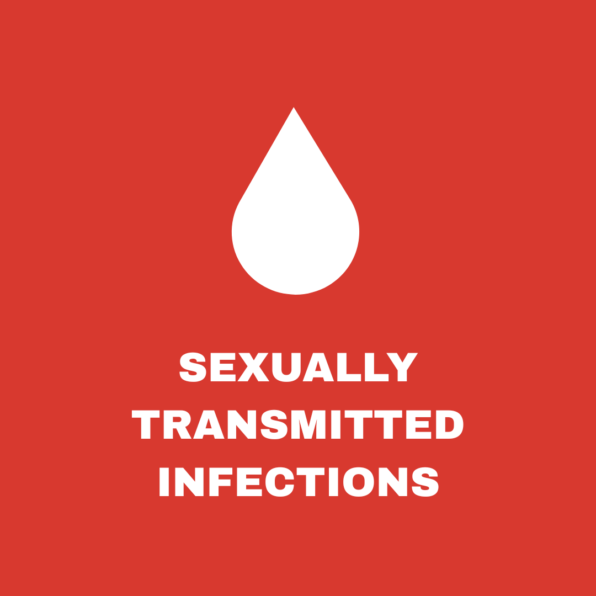
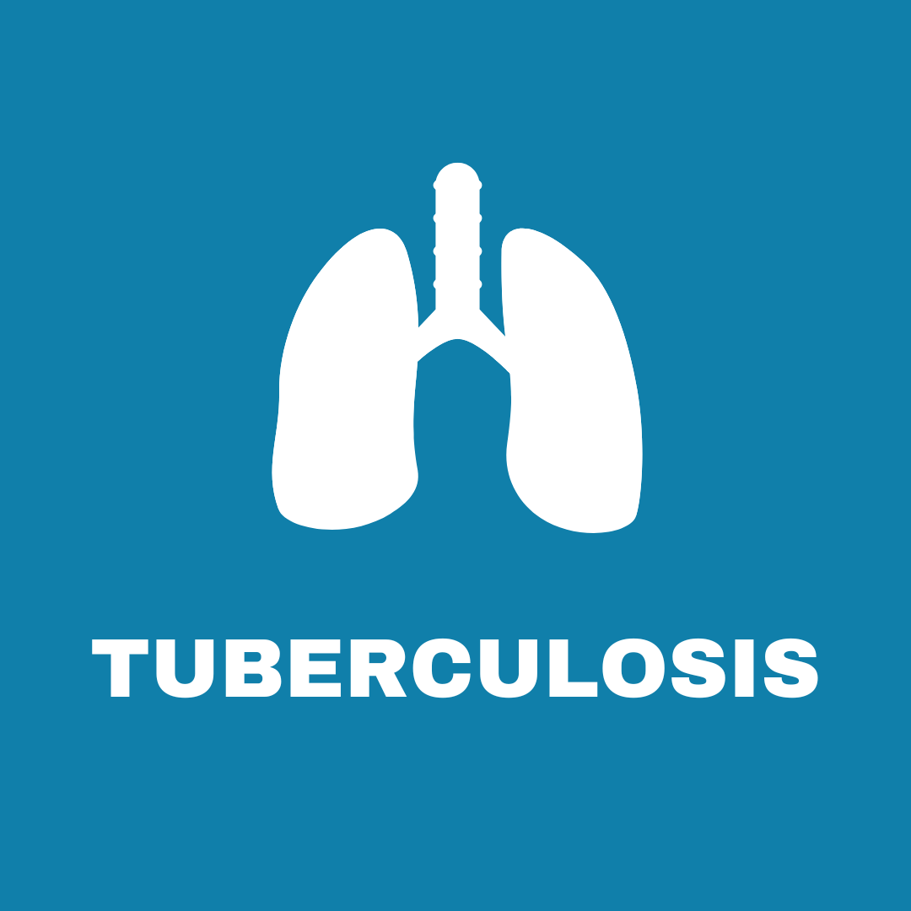
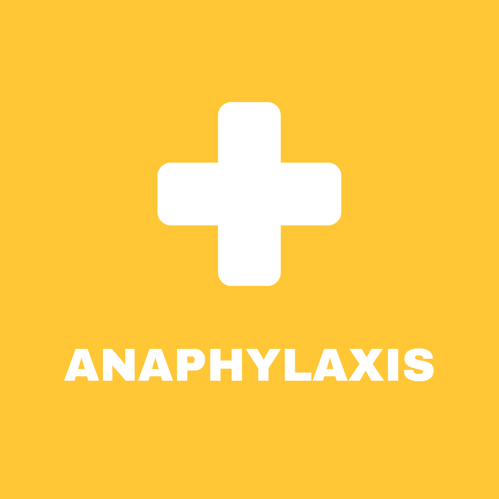

# RESEARCH

## RESEARCH SUMMARY

My research centres on the social epidemiology of sexually transmitted infections (STIs), with a focus on marginalized and underserved populations, including men who have sex with men (MSM) and sex worker communities. I am particularly interested in STI prevention and control, with an emphasis on the structural, behavioural, and social determinants that shape health inequities.

I also examine infectious disease prevention and response in low- and middle-income countries (LMICs) and low-resource settings. My current work includes evaluating pay-it-forward approaches as innovative behavioural interventions to improve access to gonorrhea and chlamydia testing among MSM in China. I also maintain broader interests in respiratory infections, including tuberculosis (TB), respiratory syncytial virus (RSV), influenza (flu), and coronavirus disease 2019 (COVID-19). While I have growing interests in health economic and infectious disease modelling, my current focus lies in mixed-methods research, knowledge synthesis, and epidemiological analysis. I am actively engaged in knowledge translation (KT) and knowledge mobilization (KMb) efforts to bridge research with policy and practice, ensuring that evidence informs real-world decision-making.

In addition to my work in infectious diseases, I have a longstanding interest in allergy and clinical immunology, particularly in the areas of pediatric allergy and immunology and allergen immunotherapy. I am also interested in the pharmacoeconomic evaluation of HIV prevention strategies, including pre-exposure prophylaxis (PrEP) and post-exposure prophylaxis (PEP).

$~$

<h2 style="color: #1B153E; font-weight: 600; border-bottom: none; margin-bottom: 0.5rem;">CURRENT RESEARCH</h2>

Learn more about each research theme by clicking on each tile.

<div style="margin-bottom: 2rem;"></div>

<div style="display: grid; grid-template-columns: repeat(auto-fit, minmax(250px, 1fr)); gap: 1.5rem; margin-bottom: 2rem;">

  <!-- STIs -->
  <a href="sti.qmd" style="text-decoration: none;">
    
  </a>

  <!-- TB -->
  <a href="tb.qmd" style="text-decoration: none;">
    
  </a>

  <!-- Mpox -->
  <a href="mpox.qmd" style="text-decoration: none;">
    
  </a>

  <!-- Anaphylaxis -->
  <a href="anaphylaxis.qmd" style="text-decoration: none;">
    
  </a>

</div>

$~$

## RESEARCH INTERESTS

- Social epidemiology of sexually transmitted infections (STIs)  
- Infectious disease prevention and control in low- and middle-income countries (LMICs) and low-resource settings  
- Respiratory infectious diseases (e.g., tuberculosis [TB], respiratory syncytial virus [RSV], influenza [flu], COVID-19)  
- Health equity among men who have sex with men (MSM) and sex worker populations  
- Allergy (asthma, atopic dermatitis, drug allergy, food allergy, anaphylaxis)  
- Allergen immunotherapy (subcutaneous immunotherapy [SCIT], sublingual immunotherapy [SLIT])  
- Dermatoepidemiology  
- Behavioural interventions for health service uptake (e.g., pay-it-forward)  
- Knowledge synthesis in allergy and infectious diseases  
- Knowledge translation and knowledge mobilization (KT/KMb)  
- Implementation science  
- Infectious disease modelling  
- Pharmacoeconomics (allergy and infectious diseases)  

## RESEARCH AREAS

- Epidemiology (Communicable and Non-Communicable Diseases)  
- Infectious Diseases  
- Sexually Transmitted Infections (STIs)  
- HIV/AIDS  
- Allergy and Clinical Immunology  
- Dermatology  
- Pediatrics  
- Public Health  
- Global Health  
- Health Systems Research  
- Implementation Science  
- Health Economics and Outcomes Research  

## KEYWORDS

Public health, epidemiology, infectious diseases, sexually transmitted infections (STI), HIV/AIDS, sexual health, allergy, clinical immunology, asthma, atopic dermatitis, drug allergy, food allergy, anaphylaxis, mixed-methods research, implementation science, knowledge synthesis, low- and middle-income countries (LMIC), health equity

$~$

```{=html}
<!-- Research Platforms Section -->
<div style="
  width: 100%;
padding: 0 0 1.5rem 0;
  background-color: #ffffff;
">

  <h2 style="
    font-size: 1.05rem;
    font-weight: 600;
    color: #1B153E;
    text-align: left;
    margin-bottom: 1.25rem;
    line-height: 1.4;
    border: none;
  ">
    For a complete list of my publications, please visit the following research platforms:
  </h2>

  <div style="
    display: flex;
    justify-content: flex-start;
    align-items: center;
    gap: 0.75rem;
    flex-wrap: nowrap;
    overflow-x: auto;
  ">

    <a href="https://scholar.google.com/citations?user=pUPl3Q8AAAAJ&hl=en" target="_blank"
       class="explore-button"
       style="flex: 0 0 auto; padding: 0.4rem 1rem !important; font-size: 0.9rem !important; width: auto !important; min-width: unset !important; white-space: nowrap !important; text-align: center;">
       Google Scholar
    </a>

    <a href="https://www.webofscience.com/wos/author/record/KUF-3735-2024" target="_blank"
       class="explore-button"
       style="flex: 0 0 auto; padding: 0.4rem 1rem !important; font-size: 0.9rem !important; width: auto !important; min-width: unset !important; white-space: nowrap !important; text-align: center;">
       Web of Science
    </a>

    <a href="https://pubmed.ncbi.nlm.nih.gov/?term=Batac+ALR%5BAuthor%5D&sort=date" target="_blank"
       class="explore-button"
       style="flex: 0 0 auto; padding: 0.4rem 1rem !important; font-size: 0.9rem !important; width: auto !important; min-width: unset !important; white-space: nowrap !important; text-align: center;">
       PubMed
    </a>

    <a href="https://orcid.org/0000-0002-5712-5483" target="_blank"
       class="explore-button"
       style="flex: 0 0 auto; padding: 0.4rem 1rem !important; font-size: 0.9rem !important; width: auto !important; min-width: unset !important; white-space: nowrap !important; text-align: center;">
       ORCiD
    </a>

    <a href="https://www.researchgate.net/profile/Ayel-Luis-Batac" target="_blank"
       class="explore-button"
       style="flex: 0 0 auto; padding: 0.4rem 1rem !important; font-size: 0.9rem !important; width: auto !important; min-width: unset !important; white-space: nowrap !important; text-align: center;">
       ResearchGate
    </a>

  </div>
</div>

```

$~$