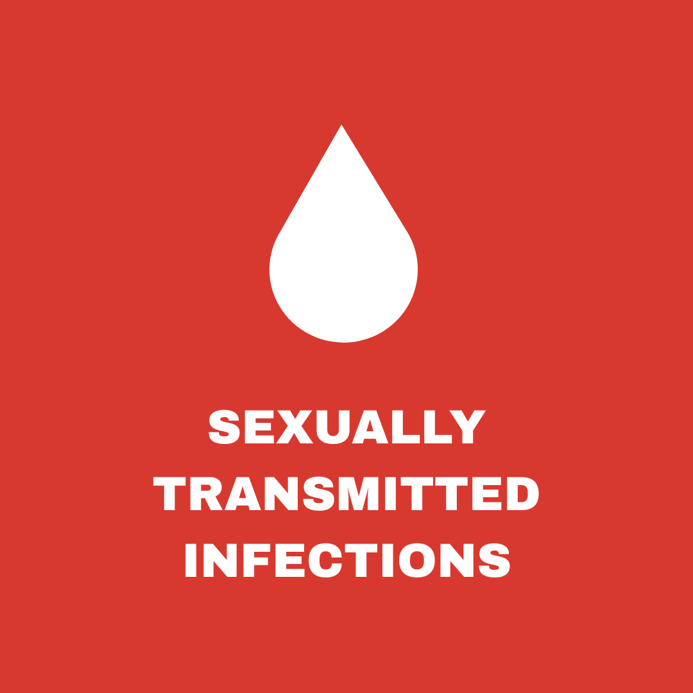
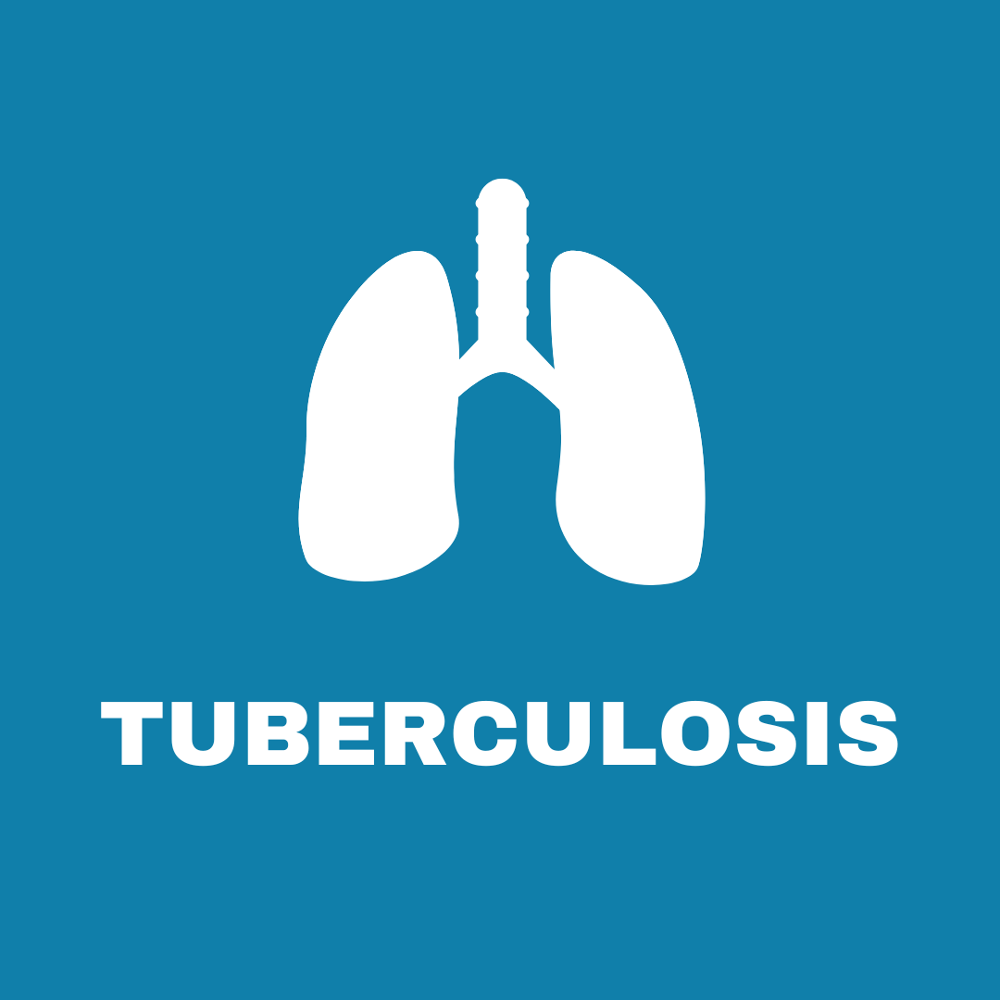
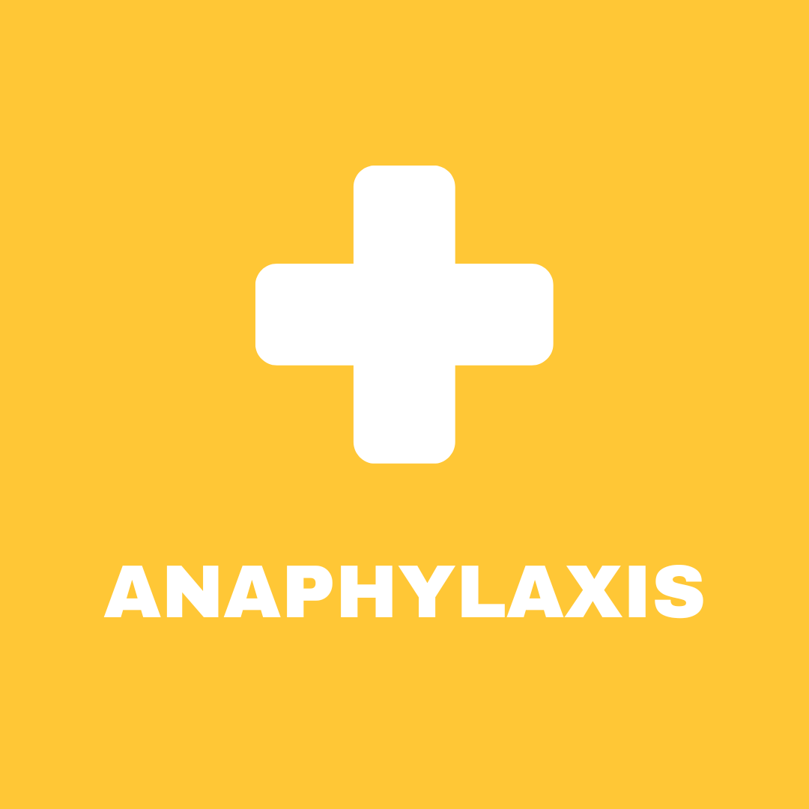

# RESEARCH

## RESEARCH SUMMARY

My research focuses on the social epidemiology of sexually transmitted infections (STIs), particularly among marginalized and underserved populations such as men who have sex with men (MSM) and sex worker communities. I am especially interested in how social conditions, health behaviours, and the organization of health services shape access to STI prevention and care. Much of my work examines inequities in testing and how prevention strategies can better reach populations underserved by existing services.

This interest extends to infectious disease prevention in low- and middle-income countries (LMICs) and other low-resource settings. My current research in China examines whether a pay-it-forward approach can increase gonorrhoea and chlamydia testing among MSM. Through this approach, individuals receive testing as a gift and may choose to contribute toward testing for someone else. This work evaluates an alternative model for expanding access to STI testing while incorporating community participation into service delivery.

Methodologically, I use mixed methods to address questions in epidemiology and health policy while drawing on the social and behavioural sciences to understand engagement with infectious disease prevention and health services. I also use community-based and participatory approaches, including crowdsourcing, to involve communities in developing responses to public health problems. My work in knowledge translation and knowledge mobilization examines how research findings and community-generated knowledge are used in public health decision-making.

My broader work in infectious diseases includes respiratory infections and tropical diseases that contribute substantially to disease burden in LMICs. I am also developing work in health economics and infectious disease modelling. In health economics, my research focuses on the economic evaluation of HIV prevention using pre-exposure prophylaxis (PrEP) and STI prevention using doxycycline post-exposure prophylaxis (doxyPEP). My interests in infectious disease modelling centre on participatory mathematical modelling and the incorporation of community perspectives into modelling processes.

Alongside my work in infectious diseases, I have maintained a longstanding interest in allergy and clinical immunology, particularly anaphylaxis and allergen immunotherapy.

$~$

<h2 style="color: #1B153E; font-weight: 600; border-bottom: none; margin-bottom: 0.5rem;">CURRENT RESEARCH</h2>

Learn more about each research theme by clicking on each tile.

<div style="margin-bottom: 2rem;"></div>

<div style="display: grid; grid-template-columns: repeat(auto-fit, minmax(250px, 1fr)); gap: 1.5rem; margin-bottom: 2rem;">

  <!-- STI -->
  <a href="sti.qmd" style="text-decoration: none;">
    
  </a>

  <!-- Diagnostics -->
  <a href="diagnostics.qmd" style="text-decoration: none;">
    
  </a>

  <!-- Tuberculosis -->
  <a href="tuberculosis.qmd" style="text-decoration: none;">
    
  </a>

  <!-- Mpox -->
  <a href="mpox.qmd" style="text-decoration: none;">
    
  </a>

  <!-- Anaphylaxis -->
  <a href="anaphylaxis.qmd" style="text-decoration: none;">
    
  </a>

</div>

$~$

## RESEARCH INTERESTS

- Social epidemiology of sexually transmitted infections (STIs)  
- Infectious disease prevention and control in low- and middle-income countries (LMICs) and low-resource settings  
- Respiratory tract infections (COVID-19, respiratory syncytial virus, tuberculosis)  
- Community-based and participatory research    
- Allergy (anaphylaxis, asthma, atopic dermatitis, drug allergy, food allergy)  
- Allergen immunotherapy (subcutaneous immunotherapy, sublingual immunotherapy)  
- Dermatoepidemiology  
- Behavioural interventions for health service uptake  
- Diagnostics   
- Evidence synthesis in allergy and infectious diseases  
- Implementation science  
- Mathematical modelling    
- Health economic evaluation

## RESEARCH AREAS

- Allergy and Clinical Immunology   
- Infectious Diseases  
- Sexually Transmitted Infections (STIs)  
- HIV/AIDS  
- Dermatology  
- Pediatrics  
- Public Health  
- Global Health  
- Epidemiology (Communicable and Non-Communicable Diseases)  
- Health Systems Research  
- Health Policy   
- Health Economics  
- Implementation Science  

## KEYWORDS

Allergy, anaphylaxis, atopic dermatitis, drug allergy, food allergy, infectious diseases, sexually transmitted infections, STI, gonorrhea, chlamydia, syphilis, HIV/AIDS, coronavirus disease 2019, COVID-19, tuberculosis, TB, diagnostics, sexual health, stigma, public health, global health, mixed methods, implementation science, health systems research, health policy, evidence synthesis, low- and middle-income countries, LMIC, health equity

$~$

```{=html}
<!-- Research Platforms Section -->
<div style="
  width: 100%;
padding: 0 0 1.5rem 0;
  background-color: #ffffff;
">

  <h2 style="
    font-size: 1.05rem;
    font-weight: 600;
    color: #1B153E;
    text-align: left;
    margin-bottom: 1.25rem;
    line-height: 1.4;
    border: none;
  ">
    For a complete list of my publications, please visit the following research platforms:
  </h2>

  <div style="
    display: flex;
    justify-content: flex-start;
    align-items: center;
    gap: 0.75rem;
    flex-wrap: nowrap;
    overflow-x: auto;
  ">

    <a href="https://scholar.google.com/citations?user=pUPl3Q8AAAAJ&hl=en" target="_blank"
       class="explore-button"
       style="flex: 0 0 auto; padding: 0.4rem 1rem !important; font-size: 0.9rem !important; width: auto !important; min-width: unset !important; white-space: nowrap !important; text-align: center;">
       Google Scholar
    </a>

    <a href="https://www.webofscience.com/wos/author/record/KUF-3735-2024" target="_blank"
       class="explore-button"
       style="flex: 0 0 auto; padding: 0.4rem 1rem !important; font-size: 0.9rem !important; width: auto !important; min-width: unset !important; white-space: nowrap !important; text-align: center;">
       Web of Science
    </a>

    <a href="https://pubmed.ncbi.nlm.nih.gov/?term=Batac+ALR%5BAuthor%5D&sort=date" target="_blank"
       class="explore-button"
       style="flex: 0 0 auto; padding: 0.4rem 1rem !important; font-size: 0.9rem !important; width: auto !important; min-width: unset !important; white-space: nowrap !important; text-align: center;">
       PubMed
    </a>

    <a href="https://orcid.org/0000-0002-5712-5483" target="_blank"
       class="explore-button"
       style="flex: 0 0 auto; padding: 0.4rem 1rem !important; font-size: 0.9rem !important; width: auto !important; min-width: unset !important; white-space: nowrap !important; text-align: center;">
       ORCiD
    </a>

    <a href="https://www.researchgate.net/profile/Ayel-Luis-Batac" target="_blank"
       class="explore-button"
       style="flex: 0 0 auto; padding: 0.4rem 1rem !important; font-size: 0.9rem !important; width: auto !important; min-width: unset !important; white-space: nowrap !important; text-align: center;">
       ResearchGate
    </a>

  </div>
</div>

```

$~$